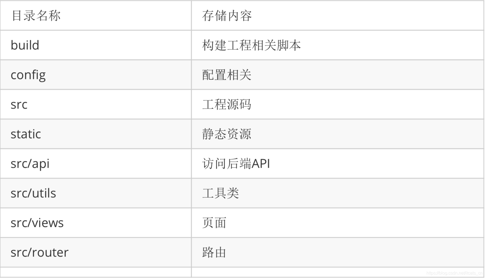

# lisa.frontend

## 项目设置
```sh
yarn install
```

### 编译并重新加载以进行开发
```sh
yarn serve
```

### 为生产而编译和缩小
```sh
yarn build
```

### Lints和fixes文件
```sh
yarn lint
```

>## 自定义配置

Vue CLI [配置参考](https://cli.vuejs.org/config/).

ElementUI [配置参考](https://element-plus.gitee.io/).


>## 3. Vue 命令的各种应用
```sh
# npm持久使用淘宝镜像安装依赖包(加速)

#npm
npm config set registry https://registry.npm.taobao.org

#yarn 先安装yarn
yarn config set registry http://registry.npm.taobao.org/

npm install -g @vue/cli

vue create 文件名

//进入到这个项目来
cd 文件名

npm i -g yarn

yarn

yarn add vue-router

yarn serve

yarn build
```

>## ECharts
```sh
## ECharts 是一个使用 JavaScript 实现的开源可视化库,涵盖各行业图表,满足各种需求

# 安装

yarn add echarts

ElementUI [配置参考](https://echarts.apache.org/zh/index.html).
```


>## axios
```sh
# 安装

yarn add axios

```

>## icon
```sh
# 安装

yarn add vue-icon


# shift+tab 代码后退快捷键

# top 代码前进快捷键
```
 

>## 主要的目录结构如下图所示：



icon 视频

https://www.bilibili.com/video/av290496588


## 网站git ： git clone https://github.com/lin-xin/vue-manage-system.git

网站：bootstrapmb.com


https://www.cnblogs.com/qisi007/p/10200140.html